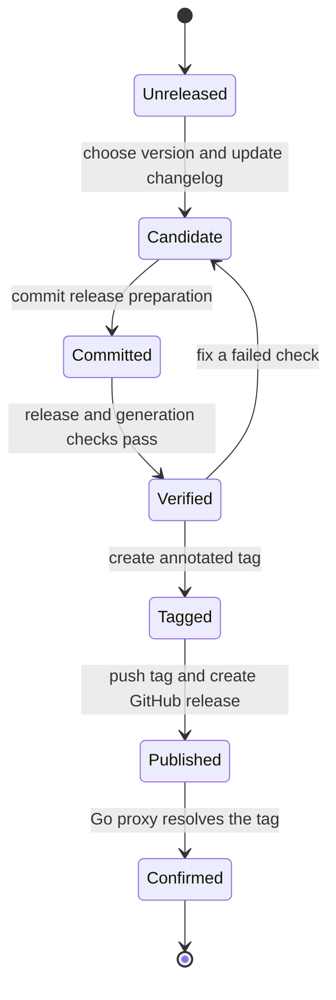

# Release and versioning rules

This repository uses [Semantic Versioning 2.0.0](https://semver.org/) and Go module tags in `vMAJOR.MINOR.PATCH` form. Minecraft versions and protocol numbers do not determine the module version.

## Version stability

Releases start in the `v0.x.y` series. A `v0` minor release may break an API while the design settles. Every breaking `v0` change requires a changelog entry, a `**Breaking:**` marker, and migration instructions.

The `v1.0.0` release starts compatibility guarantees for the public API. Starting with `v2.0.0`, the module path must include the matching major suffix, such as `github.com/go-theft-craft/minecraft-protocol/v2`.

## Public compatibility contract

The compatibility contract includes:

- exported Go names, signatures, interfaces, constants, and documented behavior;
- generated packet and data types intended for callers;
- built-in protocol profile identifiers;
- capture and manifest formats;
- command names, flags, exit behavior, and documented structured output; and
- default limit behavior for inputs that earlier releases accepted.

Internal packages, test fixtures, and generated files marked internal do not form part of the public contract.

## Pick the version change

```mermaid
flowchart TD
    A[Release candidate] --> B{Does it break the public contract?}
    B -->|Yes, after v1| C[Major release]
    B -->|Yes, before v1| D[Minor release with migration notes]
    B -->|No| E{Does it add public capability?}
    E -->|Yes| F[Minor release]
    E -->|No| G[Patch release]
```

Use these project rules:

| Change | Version |
| --- | --- |
| Add a protocol version, dataset, lookup, codec, or optional CLI command | Minor |
| Add fields to a struct that callers construct with literals | Major after `v1` |
| Remove a built-in protocol version | Major after `v1` |
| Rename or change the type of a public generated field | Major after `v1` |
| Change a capture or manifest format without backward reading support | Major after `v1` |
| Correct packet encoding, data, or lookup behavior without breaking valid callers | Patch |
| Tighten a bound to fix a security issue | Patch with a `Security` entry and impact note |
| Change documentation, tests, or internal generation code only | Patch |

## Pre-releases

Use `-alpha.N`, `-beta.N`, and `-rc.N` in that order. Do not use a pre-release tag as the latest stable release. Publish an `rc` before `v1.0.0` and before every later major release.

## Changelog rules

Maintain [CHANGELOG.md](CHANGELOG.md) during development. Put each user-visible change under `Unreleased` in one of these sections:

- `Added`
- `Changed`
- `Deprecated`
- `Removed`
- `Fixed`
- `Security`

Write entries for users, not for commit history. Mark a breaking entry with `**Breaking:**` within its category. Include a migration instruction or a link to one.

At release time, rename `Unreleased` to the version and UTC date in `YYYY-MM-DD` form. Add a fresh empty `Unreleased` section above it.

## Release flow

Release only from a clean `main` branch whose CI checks pass.

1. Review `CHANGELOG.md` and choose the version from the rules above.
2. Replace `Unreleased` with the version and current UTC date.
3. Add a new empty `Unreleased` section.
4. Commit the release preparation.
5. Run `devbox run -- task release:check VERSION=vMAJOR.MINOR.PATCH`.
6. Run generation checks when generated protocol or data files changed.
7. Run the verify task of each repository under [Consumers](#consumers) whose shared contracts changed.
8. Create an annotated `vMAJOR.MINOR.PATCH` tag on the verified commit.
9. Push the commit and the tag.
10. Create a GitHub release from the matching changelog section.
11. Confirm that `go list -m github.com/go-theft-craft/minecraft-protocol@vMAJOR.MINOR.PATCH` resolves the release.
12. Open the version bump in every repository under [Consumers](#consumers), and run each one's verify against it. A consumer that should not take this release records why, in its own changelog.

`release:check` rejects a dirty tree, a local `replace` directive, and an invalid version. Do not move or reuse a published tag. Publish a new patch release for a correction.

## Release tooling

Library releases use annotated Git tags and GitHub releases directly. Do not add
GoReleaser merely to publish the module or generate its changelog; the reviewed
`CHANGELOG.md` remains the release-note source.

Adopt GoReleaser when this repository ships the planned `mcproto` command. Its
scope will be reproducible cross-platform binaries, checksums, provenance, and
GitHub release assets. Go module tags remain the source of module versions.

## Consumers

These repositories require this module:

| Repository | What it takes |
| --- | --- |
| `server` | the root package, `wire/java`, `generated/java/v1_8`, `generated/java/v26_1`, `data`, and `login`, vendored. Its examples module carries the same version indirectly |
| `minecraft-simulation` | `data`, `generated/java/v1_8`, and `generated/java/v26_1` |
| `headless-minecraft` | the root package, both generated Java profiles, `data`, and `login` — in its root module and again in its examples module, which pins its own copy |
| `relay` | the examples module only. The core module requires nothing, and a release must never be the reason that changes |

The legacy proxy is not on this list. It consumes the relay framework and the
simulation, requires this module nowhere, and its codec owns its own fixed-width
readers by a recorded decision — the legacy protocol shares nothing with modern
Java Edition beyond the byte order of those numbers, so depending on a codec for
another protocol would add coupling and remove nothing.

A release is not finished when the tag is pushed. It is finished when every
repository above requires it, or has recorded why it does not.

0.6.0 is why this rule is written down. It corrected a quantised-vector byte
order, and `headless-minecraft` — the one consumer whose read path that defect
reached — stayed on 0.5.0 and kept decoding every entity velocity a 26.1 server
sent into a number that was not the velocity. Nothing was red: its local gate
resolved a Go workspace pointing at this working tree, so the fix looked present
there and was absent in everything it built.

Tag this module before a dependent release. A dependent's published tag must use
a released version of this module and must not carry a local `replace` directive
for it.

The [Go module version documentation](https://go.dev/doc/modules/version-numbers) defines Go's stability meaning. The [Go module reference](https://go.dev/ref/mod#major-version-suffixes) defines major-version suffixes.
