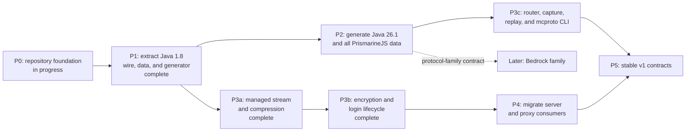

# Roadmap

The roadmap records dependency order, not release dates. Completed work remains in the chart so later decisions retain context.

## P0: repository foundation

- Define edition-neutral protocol contracts.
- Enforce finite resource limits with hard ceilings.
- Pin the Go toolchain through `openserbia/go-flake`.
- Establish release, changelog, and roadmap rules.

## P1: Java 1.8 extraction

Status: complete.

- Extract reusable wire and game-data code from `server`.
- Preserve protocol 47 behavior with checked-in byte fixtures.
- Generate the built-in protocol 47 descriptor and direct packet codecs without
  reflection in generated runtime paths.

## P2: current Java data

- Generate protocol 775 for the Java 26.1 data family.
- Import every dataset exposed by the pinned PrismarineJS manifest.
- Preserve unknown JSON, YAML, and future source formats as raw datasets.

## P3a: managed stream and compression

Status: complete.

- Replaced `protocol.Codec` with session, packet, frame, and compression
  boundaries.
- Added the asynchronous managed stream with a read pump, a write pump, and one
  coordinator that orders every state change, control, observation, and
  shutdown step.
- Added bounded Java compression envelopes with strict and compatible policies.
- Added protocol 47 automatic transitions, developer-controllable transition
  policy, runtime controls, and state-appropriate graceful disconnect.
- Added the opt-in legacy `FE 01` pre-frame hook.
- Added lossless observation points that later capture work can subscribe to.
- Added loopback TCP scenarios and pinned Node `minecraft-protocol` 1.66.2
  interoperability tests as a required gate.

## P3b: encryption and login lifecycle

Status: complete, except for the modern-login transitions, which need the
protocol 775 codecs that P2 generates.

- Added AES-CFB8 at the transport boundary, in the correct pipeline order,
  through a conduit that transforms bytes as it hands them out.
- Added the key-exchange primitives, the Java server hash, and strict identity
  types for every peer-supplied login field.
- Added the opt-in `login` negotiator, which drives the client sequence for an
  offline or externally authenticated identity without coupling authentication
  to the stream.
- Added secret redaction in observations, with disclosure behind an explicit,
  reasoned opt-in.
- Add configuration and play transitions for modern Java login, keeping every
  automatic transition optional.

## P3c: routing, capture, replay, and CLI

Depends on the protocol 775 datasets from P2.

- Add packet routing and ordered middleware outside framing.
- Add bounded in-memory history and durable capture sinks on top of the
  observation points P3a already publishes.
- Add deterministic replay with explicit timing modes.
- Add the non-interactive `mcproto` command.

## P4: shared consumers

Server and `headless-minecraft` migration comes before protocol 775.

- Migrate `server` to the shared Java 1.8 packages.
- Migrate `proxy` imports while keeping legacy internal.
- Connect `headless-minecraft` to the current Java profile.

## P5: stable contracts

- Publish `v1.0.0` after public APIs have compatibility tests.
- Document support windows for built-in protocol versions.
- Require migration notes for every later breaking change.

## Deferred conformance work

The P3a gate runs the pinned Node `minecraft-protocol` implementation on
loopback. These wider conformance lanes are deliberately deferred, with the
repository that owns each one named:

| Lane | Owner |
| --- | --- |
| Paper 26.1 compatibility matrix | `minecraft-protocol` |
| MCProtocolLib compatibility matrix | `minecraft-protocol` |
| Instrumented vanilla-client scenarios | `headless-minecraft` |
| Movement, combat, and crafting scenario matrix | `minecraft-simulation`, `server` |

An archived Paper 1.8 run is optional and is not a P3 gate.

## Deferred work

Bedrock transport, authentication, codecs, and client behavior require a separate design. The shared edition contract must remain able to host that work without applying Java transport assumptions.
