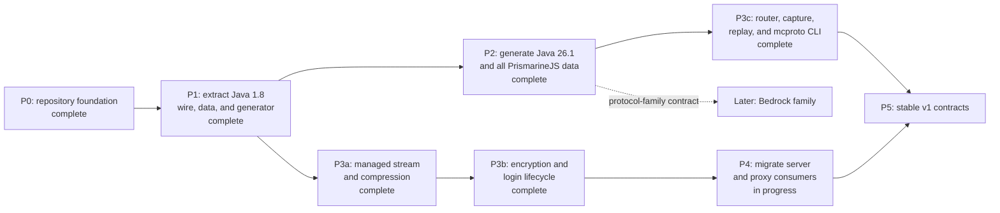

# Roadmap

The roadmap records dependency order, not release dates. Completed work remains in the chart so later decisions retain context.

## P0: repository foundation

- Define edition-neutral protocol contracts.
- Enforce finite resource limits with hard ceilings.
- Pin the Go toolchain through `openserbia/go-flake`.
- Establish release, changelog, and roadmap rules.

## P1: Java 1.8 extraction

Status: complete.

- Extract reusable wire and game-data code from `server`.
- Preserve protocol 47 behavior with checked-in byte fixtures.
- Generate the built-in protocol 47 descriptor and direct packet codecs without
  reflection in generated runtime paths.

## P2: current Java data

Status: complete.

- Generated protocol 775 for the Java 26.1 data family: 256 framed packets
  across five states, with a checked-in coverage report.
- Imported every dataset the pinned PrismarineJS manifest exposes, including
  the seven with no Java 1.8 equivalent.
- Kept every dataset as the bytes upstream published, reachable through
  `v26_1.Raw()`.
- Verified the codecs against pinned Node ProtoDef in both directions.
- Ran the opt-in live check against Paper 26.1.2 build 74. It found that the
  negotiator never answered `select_known_packs`, which stalls a real login in
  configuration; that is fixed. The resource limits now stand on traffic
  through login: 12,564 bytes largest raw frame against a 2 MiB limit, 32,316
  bytes largest decoded body against 8 MiB. Play is not measured.

## P3a: managed stream and compression

Status: complete.

- Replaced `protocol.Codec` with session, packet, frame, and compression
  boundaries.
- Added the asynchronous managed stream with a read pump, a write pump, and one
  coordinator that orders every state change, control, observation, and
  shutdown step.
- Added bounded Java compression envelopes with strict and compatible policies.
- Added protocol 47 automatic transitions, developer-controllable transition
  policy, runtime controls, and state-appropriate graceful disconnect.
- Added the opt-in legacy `FE 01` pre-frame hook.
- Added lossless observation points that later capture work can subscribe to.
- Added loopback TCP scenarios and pinned Node `minecraft-protocol` 1.66.2
  interoperability tests as a required gate.

## P3b: encryption and login lifecycle

Status: complete.

- Added AES-CFB8 at the transport boundary, in the correct pipeline order,
  through a conduit that transforms bytes as it hands them out.
- Added the key-exchange primitives, the Java server hash, and strict identity
  types for every peer-supplied login field.
- Added the opt-in `login` negotiator, which drives the client sequence for an
  offline or externally authenticated identity without coupling authentication
  to the stream.
- Added secret redaction in observations, with disclosure behind an explicit,
  reasoned opt-in.
- Added configuration and play transitions for modern Java login, keeping every
  automatic transition optional. This is the item P3b could not finish without
  P2's codecs; it closed in P2, where `Negotiator` became version-neutral
  through `protocol.LoginExchange` and a full 775 login was driven through
  configuration into play. `login.Acceptor` is a separate matter: it is written
  against the `v1_8` generated types, so nothing here can *serve* a 775 login,
  and closing that is scheduled by M10.

## P3b.5: schema-first code generation

Status: complete.

- Compile every schema-defined type from its own schema; a hand-written codec
  backs only a name the schema declares native.
- Share named types that are recursive or used by more than one packet, and
  bound decode recursion against the configured depth.
- Delete the hand-written `Position`, `Slot`, and `EntityMetadata` value types.

## P3c: routing, capture, replay, and CLI

Status: complete.

- Added `router` and `middleware`, defined over one-method interfaces so that
  neither imports the stream. The one file that names a stream is the adapter.
- Added the capture format — a JSON header, then CRC-checked, length-prefixed
  binary records with an inline string table — a durable file sink, sink
  composition, and a replay digest.
- Added `history.Ring`, bounded by record count and by bytes, and documented as
  the one sink allowed to lose data.
- Added deterministic replay with explicit timing modes, offline through a
  session or connected to a peer, reporting a digest, drift, and any divergence
  between the recorded connection and what this code proposes.
- Added the non-interactive `mcproto` command set with documented exit codes,
  and verified it end to end against a real Paper 26.1.2 server: capture a
  login, inspect it, replay it, and compare the digest.
- Fixed a defect in released code that this work exposed: the raw frame of a
  packet whose decoded body was redacted carried the same bytes unredacted, so
  a capture taken with the documented defaults would have held the login key
  exchange in the clear beneath a header claiming redaction was enforced.

## P4: shared consumers

Status: the migration is done; the uptake is not. What is left is scheduled by
[the P4 plan](docs/superpowers/plans/2026-08-18-p4-shared-consumers.md), which
checked each bullet below against the working trees on 2026-08-18.

- Migrated `server` to the shared Java 1.8 packages. It owns no wire code at
  all: `pkg/gamedata`, `cmd/codegen`, and `cmd/dmd` are gone, every packet is a
  generated type, and its byte-parity fixtures still match.
- **Superseded:** migrating `proxy` imports. The legacy proxy requires `relay`
  and `minecraft-simulation` and requires this module nowhere; its codec owns
  its byte primitives by a recorded decision, because the legacy protocol shares
  nothing with modern Java Edition beyond the byte order of its fixed-width
  numbers.
- Connected `headless-minecraft` to the current Java profile, on both protocol
  47 and protocol 775.

Two consumers arrived after P4 was written and belong to it now:
`minecraft-simulation` and `relay`'s examples module, both on `v0.6.0` — and
`relay`'s core module requires nothing, which is a property to keep.

What the plan still owns: making the local gate resolve what CI resolves, so a
Go workspace cannot make a stale pin look current, and writing the uptake step
into the release flow so the next fix reaches consumers by process rather than
by memory.

## P5: stable contracts

- Publish `v1.0.0` after public APIs have compatibility tests.
- Document support windows for built-in protocol versions.
- Require migration notes for every later breaking change.

## Deferred conformance work

The P3a gate runs the pinned Node `minecraft-protocol` implementation on
loopback. These wider conformance lanes are deliberately deferred, with the
repository that owns each one named:

| Lane | Owner |
| --- | --- |
| Paper 26.1 compatibility matrix | `minecraft-protocol` |
| MCProtocolLib compatibility matrix | `minecraft-protocol` |
| Instrumented vanilla-client scenarios | `headless-minecraft` |
| Movement, combat, and crafting scenario matrix | `minecraft-simulation`, `server` |

An archived Paper 1.8 run is optional and is not a P3 gate.

## Deferred work

Bedrock transport, authentication, codecs, and client behavior require a separate design. The shared edition contract must remain able to host that work without applying Java transport assumptions.
