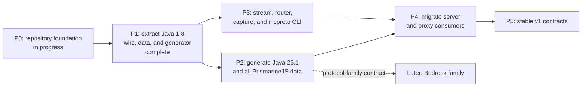

# Roadmap

The roadmap records dependency order, not release dates. Completed work remains in the chart so later decisions retain context.

## P0: repository foundation

- Define edition-neutral protocol contracts.
- Enforce finite resource limits with hard ceilings.
- Pin the Go toolchain through `openserbia/go-flake`.
- Establish release, changelog, and roadmap rules.

## P1: Java 1.8 extraction

Status: complete.

- Extract reusable wire and game-data code from `server`.
- Preserve protocol 47 behavior with checked-in byte fixtures.
- Generate the built-in protocol 47 descriptor and direct packet codecs without
  reflection in generated runtime paths.

## P2: current Java data

- Generate protocol 775 for the Java 26.1 data family.
- Import every dataset exposed by the pinned PrismarineJS manifest.
- Preserve unknown JSON, YAML, and future source formats as raw datasets.

## P3: reusable protocol tools

- Add the bounded managed stream.
- Add compression, encryption, routing, middleware, capture, replay, status,
  and complete login helpers.
- Add the non-interactive `mcproto` command.

## P4: shared consumers

- Migrate `server` to the shared Java 1.8 packages.
- Migrate `proxy` imports while keeping legacy internal.
- Connect `headless-minecraft` to the current Java profile.

## P5: stable contracts

- Publish `v1.0.0` after public APIs have compatibility tests.
- Document support windows for built-in protocol versions.
- Require migration notes for every later breaking change.

## Deferred work

Bedrock transport, authentication, codecs, and client behavior require a separate design. The shared edition contract must remain able to host that work without applying Java transport assumptions.
