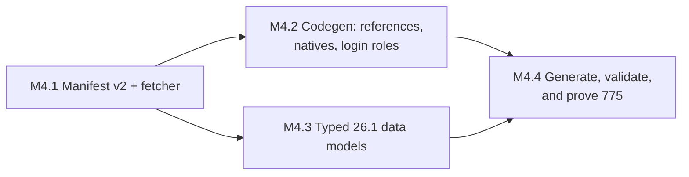

# Java 26.1 and protocol 775 design

- Status: Draft for review
- Date: 2026-08-15
- Repository: `minecraft-protocol`
- Milestone: M4

## Context

The repository generates one protocol: Java 1.8.9, protocol 47, from a pinned
PrismarineJS revision. Everything above it — bounded wire primitives, the
managed stream, compression, encryption, and the login negotiator — is version
neutral by construction. Nothing else in the toolkit knows a version number.

M4 adds the second protocol, and the second protocol is the one that proves the
generator is a generator rather than a 1.8-shaped special case.

The measurements in this document come from the pinned upstream revision
`8a80816cbfb3fe2b609f2cde4e57796c8033af61`, read directly. They are facts about
the source, not estimates.

## What the pinned source actually contains

`data/dataPaths.json` resolves `pc/26.1` to 24 datasets plus `proto`. Six of
them alias older directories:

| Dataset | Resolved path |
| --- | --- |
| `blockLoot`, `entityLoot` | `pc/1.20` |
| `commands` | `pc/1.20.3` |
| `mapIcons` | `pc/1.20.2` |
| `windows` | `pc/1.16.1` |
| `proto` | `pc/latest` |

Everything else resolves to `pc/26.1`. `version.json` reports
`{"version": 775, "minecraftVersion": "26.1", "majorVersion": "26.1",
"releaseType": "release"}`.

`protocol.json` declares five states and 257 packets:

| State | Clientbound | Serverbound |
| --- | --- | --- |
| handshaking | 0 | 2 |
| status | 2 | 2 |
| login | 6 | 5 |
| configuration | 20 | 10 |
| play | 141 | 69 |

> **Corrected 2026-08-15, during M4.2.** This table originally read 242
> packets, with 5/4 for login, 11/6 for configuration, and 143/67 for play.
> Counting the packet mappings in the pinned `protocol.json` at commit
> `8a80816c` gives the numbers above. Configuration is the largest divergence,
> 30 against 17. The original figures were written before the tree was pinned
> and do not describe it. M4.5's coverage assertions use the measured counts.

It declares 111 root named types and 31 root natives. The natives are the
interesting part, because a native is a name the schema refuses to define and
the generator must implement by hand:

```text
varint varlong pstring buffer u8 u16 u32 u64 i8 i16 i32 i64 bool f32 f64
UUID option entityMetadataLoop topBitSetTerminatedArray bitfield bitflags
container switch void array restBuffer anonymousNbt anonOptionalNbt
registryEntryHolder registryEntryHolderSet lpVec3
```

Six of those are new to this repository: `anonymousNbt`, `anonOptionalNbt`,
`registryEntryHolder`, `registryEntryHolderSet`, `lpVec3`, and
`topBitSetTerminatedArray`. Three natives the 1.8 generator special-cases —
`nbt`, `slot`, and `position` — are gone. `Slot` and `position` are now ordinary
named types defined in the schema, and `nbt` has split into the two anonymous
forms, because modern Java sends network NBT with no root name.

Construct counts across the whole file: 480 containers, 146 arrays, 90 options,
80 switches, 59 mappers, 16 `registryEntryHolder`, 15 buffers, 11 bitfields,
7 bitflags, 2 `registryEntryHolderSet`, 1 `entityMetadataLoop`, 1
`topBitSetTerminatedArray`, 1 `pstring`. No schema uses a `$` parameter and no
site invokes a named type with arguments, so the parser's existing
"unsupported parameterized alias" rejection never fires on this input.

Three named types are mutually recursive:

```text
SlotComponent -> Slot -> SlotComponent
SlotComponent -> ItemBlockPredicate -> DataComponentMatchers
              -> ExactComponentMatcher -> SlotComponent
ItemEffectDetail -> ItemEffectDetail
```

Fourteen switch and count sites reference a member inside a sibling bitfield or
bitflags value, by path:

```text
flags/has_redirect_node   flags/command_node_type   flags/min_present
flags/max_present         flags/has_background_texture
flags/has_custom_suggestions (via ../)
../action/add_player      ../action/initialize_chat  ../action/update_listed
../action/update_display_name  ../action/update_game_mode
../action/update_hat      ../action/update_latency   ../action/update_list_order
```

The four largest switches are the clientbound play packet dispatch (141 cases),
`SlotComponent` on data component type (110 cases), the serverbound play
dispatch (69 cases), and the command node parser switch (51 cases).

## Gaps between that source and the current generator

The current pipeline is `protodef.Parse` → `packetgen` model → templates. It
handles protocol 47 completely. Against protocol 775 it fails in four specific
places, each verified by reading the code rather than inferred:

1. ~~**Recursion.**~~ Moved to M2.5. `packetgen` used to flatten named types by
   inlining them per packet, which never terminates on `Slot` inside
   `SlotComponent` inside `Slot`. M2.5 adds shared named types and the
   recursion-depth counter, on protocol 47, before M3 migrates a consumer.
2. **Nested references.** `resolveReference` rejects any source containing `/`
   (`model.go:947`). The fourteen sites above all contain one.
3. **Missing natives.** The six new native names have no hand-written codec.
   M2.5 made native resolution schema-scoped, so 775's `Slot`, `position`, and
   `entityMetadata` correctly compile from the schema; but a name the schema
   declares native and the generator does not implement reaches `compileNode`'s
   `unsupported native type` error (`model.go:477`).
4. **Dataset shapes.** `data/*.go` models 1.8 shapes. A 26.1 block adds
   `defaultState`, `minStateId`, `maxStateId`, and `states`; a 26.1 entity adds
   `metadataKeys`; 26.1 recipes are keyed by result item ID with a different
   result shape; and seven datasets have no typed model at all (`blockLoot`,
   `commands`, `entityLoot`, `loginPacket`, `mapIcons`, `sounds`, `tints`).

The stream, conduit, framer, and compression are version neutral, and the
session contract already lets a version define its own states and transitions.

The login negotiator is not. M2 builds it against login-role tags on the
generated descriptor rather than against concrete packet types, so adding 775
means tagging 775's login packets — but the modern sequence has states 47 does
not, and M4 owns that. See Decision 8.

## Goals

M4 delivers:

- A pinned, reproducible source acquisition path with alias resolution and a
  per-file SHA-256 manifest, covering both 1.8 and 26.1.
- Nested member references through bitfield and bitflags values.
- Runtime codecs for the six new natives and for network NBT.
- Typed 26.1 data models owned by the version package.
- Generated `generated/java/v26_1` and a `current` alias, with configuration
  state and the modern login sequence driven by the M2 negotiator.
- Differential byte fixtures against the pinned Node ProtoDef implementation,
  and an opt-in live check against a real 26.1 server.
- A measurement of the largest frame and decompressed payload a real 26.1 login
  produces, so the default limits are set by evidence.
- Unchanged protocol 47 output, proven by `generate:check`.

Shared named types, the recursion-depth counter, and schema-scoped native
resolution are **not** in M4. They moved to M2.5, which lands them on protocol
47 before M3 migrates a consumer. M4 assumes them.

## Non-goals

- Bedrock anything.
- Consumer migration. `server`, `proxy`, and `headless-minecraft` move in M6.
- Packet routing, capture, replay, and the full `mcproto` command set. Those
  are M5; M4 adds only the `data` subcommand group the generator needs.
- Semantic interpretation of registries, chunk data, or data components.
  Generating a faithful `Slot` is in scope; understanding what a component
  means is not.
- Support for arbitrary third-party ProtoDef schemas. The generator must fail
  loudly on constructs it cannot compile, which is the opposite of tolerance.

## Decision 1: manifest v2, with a source path per dataset

The 1.8 manifest carries one `sourcePath` and a flat `files` map. That cannot
describe 26.1, where six datasets come from five other directories.

Manifest v2 records the resolution, not just the result:

```json
{
  "manifestVersion": 2,
  "edition": "java",
  "targetMinecraftVersion": "26.1",
  "sourceMinecraftVersion": "26.1",
  "protocol": 775,
  "sourceRepository": "https://github.com/PrismarineJS/minecraft-data",
  "sourceRevision": "8a80816cbfb3fe2b609f2cde4e57796c8033af61",
  "license": "MIT",
  "datasets": [
    {
      "name": "blocks",
      "file": "blocks.json",
      "sourcePath": "data/pc/26.1/blocks.json",
      "mediaType": "application/json",
      "sha256": "..."
    },
    {
      "name": "windows",
      "file": "windows.json",
      "sourcePath": "data/pc/1.16.1/windows.json",
      "mediaType": "application/json",
      "sha256": "..."
    }
  ]
}
```

The 1.8 manifest migrates to v2 in the same task that introduces it, so the
loader has one shape to read. Migration changes no bytes under
`source/java/1.8/` other than `manifest.json`, and `generate:check` proves the
generated output is identical afterwards.

A dataset whose `sourcePath` names a directory other than the target version is
an alias. Aliases are recorded because they are load-bearing: `windows` for
26.1 is 1.16.1 data, and a consumer that treats it as current will be wrong
about slot layouts.

## Decision 2: fetching is a command, not a script

`mcproto data fetch` resolves `dataPaths.json` at the pinned commit, downloads
each resolved file, hashes it, stages the tree in a temporary directory, and
renames it into place only after every hash is recorded. `mcproto data validate`
rehashes an existing tree against its manifest and exits non-zero on any
mismatch, extra file, or missing file.

Both are offline-capable in the sense that matters: `validate` never touches the
network, and `generate` reads only the validated tree. CI runs `validate` and
`generate:check`; it does not fetch. A refetch of the same commit must produce
an empty `git diff`.

The fetcher accepts an explicit commit and never a branch. Resolving `latest`
or `main` at build time would make the generated output depend on wall-clock
time, which is exactly the property the manifest exists to remove. `proto.yml`
resolves through `pc/latest`, so it is fetched at the pinned commit like
everything else and its hash is recorded; the pinned bytes, not the alias, are
what generation consumes.

## Decision 3: shared named types (inherited from M2.5)

M2.5 gives `packetgen` a shared declaration space per protocol package. A named
schema type that is recursive, or that is used by more than one packet, is
emitted once as an exported Go type in the version package and referenced by
name from every use site. M4 inherits it and adds no new machinery; the
consequences for 775 are recorded here because this is where they bite.

```go
// generated/java/v26_1/types.go
type Slot struct {
    ItemCount int32
    Item      *SlotItem // nil when ItemCount is zero
}

type SlotItem struct {
    ItemID              int32
    AddedComponentCount int32
    // ...
    AddedComponents   []SlotComponent
    RemovedComponents []int32
}

type SlotComponent struct {
    Type  string
    Value SlotComponentValue // one populated variant
}
```

Recursion terminates in Go because the recursive edge always crosses a pointer
or a slice, which every one of the three cycles does on the wire: a component
holds zero or more slots, and a slot holds zero or more components.

Recursion terminates at decode time because decoding a shared type increments a
depth counter checked against the existing `Limits.recursionDepth` ceiling
(default 512, hard 2048). A hostile peer that nests bundles a million deep gets
a bounded error at a named limit, not a stack overflow. The counter lives on the
buffer, so it is shared by every nested decode within one packet and reset per
packet.

Sharing is not only a recursion fix. `Slot` appears in most play packets;
inlining it per packet would generate megabytes of near-identical code, slow
compilation, and make a codec bug fixable in one place but visible in a hundred.

The selection rule is deterministic: a named type is shared if it is recursive,
or if it is referenced from two or more packets. Anonymous inline containers
stay inline. The rule is a pure function of the schema, so generated output
stays reproducible. For 775 it selects 15 non-native types, led by `position`
(22 packets), `ContainerID` (12), and `Slot` (8).

## Decision 4: nested references resolve through bit members

`resolveReference` gains path support with exactly one new capability: a
segment may name a member of a sibling bitfield or bitflags value. It does not
gain general nested-struct traversal, because the schema does not use it and an
unused generality is a maintenance cost with no test.

```text
flags/has_redirect_node     -> the has_redirect_node bit of the sibling `flags`
../action/add_player        -> the add_player bit of `action` in the parent scope
```

A path segment that names a non-bit member, a missing member, or a member of a
non-bit field is a generation error naming the JSON path of the offending site.

## Decision 5: six new natives, implemented in `wire/java`

Each native gets a hand-written bounded codec next to the existing ones,
registered under the name 775 declares native. M2.5 made that registration
schema-scoped, so these codecs are reachable from 775 and invisible to 47, and
`Slot`, `position`, and `entityMetadata` — which 775 defines rather than
declares native — compile from the schema instead of inheriting 1.8's bit
order. None of them may allocate before bounds are checked.

| Native | Wire form | Go type |
| --- | --- | --- |
| `anonymousNbt` | Network NBT: tag byte, then payload, no root name | `java.NBT` |
| `anonOptionalNbt` | `TAG_End` byte, or an `anonymousNbt` | `*java.NBT` |
| `registryEntryHolder` | VarInt: `0` then an inline value, or `id+1` | `java.Holder[T]` |
| `registryEntryHolderSet` | VarInt: `0` then a tag name, or `n+1` then n IDs | `java.HolderSet[T]` |
| `lpVec3` | Three length-prefixed packed components | `java.LPVec3` |
| `topBitSetTerminatedArray` | Elements whose high bit continues the array | `[]T` |

`registryEntryHolder` and `registryEntryHolderSet` are parameterized over the
inline value type, so they are the one place the generator emits a Go generic
instantiation rather than a plain call. The alternative — a generated
non-generic holder per instantiation — costs 16 near-identical types for no
gain.

Network NBT is a new codec, not a flag on the existing one. The 1.8 codec reads
a named root compound; the modern one reads a bare tag. Both are bounded by
`Limits.nbtBytes`, and both reject a nesting depth beyond `recursionDepth`.

## Decision 6: unmapped constructs fail generation

Any ProtoDef construct the model compiler cannot compile is a hard error that
stops generation and names the JSON path. There is no silent fallback to a raw
payload for a packet the generator did not understand.

The reason is that a silent fallback is indistinguishable, at the call site,
from a packet whose payload genuinely is opaque. A consumer holding an
`UnknownPacket` cannot tell whether the server sent something new or the build
quietly gave up. Failing at generation time turns a runtime mystery into a build
error with a file and a line.

`UnknownPacket` keeps its existing job: an ID the schema does not define at all,
seen at runtime, from a modded or newer server. That is a genuine unknown.

Generation also emits a coverage report — every state, direction, ID, name, and
the Go type generated for it — as `generated/java/v26_1/coverage.json`, checked
in and diffed by `generate:check`. A future upstream bump that drops or renames
a packet shows up as a reviewable diff instead of a silent behavior change.

## Decision 7: typed data models are owned by the version package

The shared `data` package keeps what is genuinely shared: ID types,
`RawDataset`, registry interfaces, `Protocol`, `Version`, and the ownership
rules. Value structs move to the version that defines them.

`v26_1` generates its own `Block`, `Item`, `Entity`, `Recipe`, and the seven
datasets with no 1.8 equivalent, and exposes them through a version-owned
container:

```go
func Data() *GameData   // typed 26.1 registries plus raw access
func Raw() *data.RawSet // version metadata, dataset names, raw bytes
```

`v1_8.Data() *data.Set` is unchanged through M4. Widening `data.Block` with
`MinStateID`, `MaxStateID`, and `States` would put four fields on the 1.8 type
that are always zero, and would repeat that for every future version. One
version's shape is not a base class for the next one.

Consumers that need cross-version access use the registry interfaces in `data`,
which both versions satisfy where the concepts line up, or `RawSet` where they
do not. M6 decides which consumers need which, because M6 is the first
milestone with a consumer holding two versions at once.

Dataset decoding is strict: unknown JSON fields fail generation. An upstream
field the models do not cover is a build error naming the dataset and the field,
not a silently dropped value. This is the same policy as Decision 6, applied to
data instead of codecs.

## Decision 8: the modern login sequence is session state, not new machinery

Protocol 775 adds the configuration state and the `login_acknowledged` and
`finish_configuration` handshakes between login, configuration, and play. Every
one of those is a transition a generated session already knows how to express:
a packet implies a `Transition`, the stream applies it in wire order at a frame
boundary, and the developer can inspect, delay, or replace it under the existing
`TransitionPolicy`.

The 775 descriptor therefore declares:

- `handshaking -> status | login`, driven by the handshake packet's next-state
  field, as today.
- `login -> configuration` on serverbound `login_acknowledged`.
- `configuration -> play` on clientbound `finish_configuration`'s serverbound
  acknowledgement.
- `play -> configuration` on clientbound `start_configuration`, which 47 has no
  analogue for and which a reconfiguring server sends mid-session.
- Compression on `set_compression`, encryption via the M2 transport control.

No new stream concept appears. If one turns out to be required, that is a
finding for M5 or M6, not a silent extension of M4.

The negotiator is the part that is not free. M2 builds it against login-role
tags carried by the generated descriptor — encryption request, encryption
response, success, set compression, and the acknowledgements — so it never names
a concrete packet type. M4 tags 775's login and configuration packets with those
roles, and adds the two roles 47 has no analogue for: `login_acknowledged`, and
the configuration-finished acknowledgement.

The negotiator's terminal state becomes a parameter rather than a constant. On
47 it returns once the session reaches play; on 775 it returns once the session
reaches play through configuration, and a caller that wants to inspect the
configuration exchange asks it to stop at configuration instead. A role a
protocol does not declare is absent, not an error, so 47 keeps working unchanged
with no version check anywhere in the negotiator.

## Decision 8a: limits are set by measurement, not by guess

Protocol 775's configuration state carries registry data, and modern chunk
packets carry more than 1.8's. The current defaults are 2 MiB per frame and
8 MiB decompressed, which match vanilla Java's own ceilings.

M4 does not retune them speculatively. The live check records the largest frame
and the largest decompressed payload it observes during a complete 26.1 login
into play, and reports both. The defaults change only if the measurement demands
it, and the recorded numbers go into the milestone notes either way, so a later
report of a frame-limit failure can be compared against what a vanilla login
actually produced.

A consumer that needs more can already raise limits through `NewLimits`. What is
missing today is evidence about where the real ceiling sits, and one live login
supplies it.

## Decision 9: the differential oracle is ProtoDef, not node-minecraft-protocol

The pinned Node `minecraft-protocol` 1.66.2 supports up to 1.21.11. Its
`supportedVersions` list does not contain 26.1, so the existing interoperability
lane cannot drive a 775 session end to end.

Its dependency tree does contain `protodef` 1.19.0 and `minecraft-data` 3.113.1,
and that `minecraft-data` ships `pc/26.1/protocol.json`. So the differential
check for M4 is at the codec level, not the session level:

1. Assert that the npm-shipped `pc/26.1/protocol.json` hashes equal to the
   pinned tree's. If upstream moved, the test fails with both hashes and the
   version bump becomes an explicit decision.
2. For a fixture set of packets, encode with Go, decode with ProtoDef, and
   compare the resulting JSON; then encode with ProtoDef, decode with Go, and
   compare field by field.
3. Keep the protocol 47 session-level lane exactly as it is.

The fixture set covers, at minimum: handshake, status request and response,
every login packet, every configuration packet, `login` (the play join packet),
`chunk_data`, `set_slot` with data components, `entity_metadata` for at least
five serializer types, `declare_commands`, and both packets using
`registryEntryHolderSet`. Session-level 775 interoperability waits for a Node
release that supports 26.1, and M4 records that as a follow-up rather than
pretending the lane exists.

## Decision 10: the live check is opt-in and narrow

A build-tagged test dials a real server whose address comes from an environment
variable, completes handshake, status, and offline login through configuration
into play, reads one clientbound play packet, and disconnects. It is not part of
`task verify`, because CI has no Minecraft server and a network-dependent gate
is a flaky gate.

`task check:live` runs it. The plan records how to stand up a 26.1 Paper server
locally. The exit criterion for M4 includes running it once against Paper and
once against a vanilla 26.1 client connecting to the Go side, with both results
recorded in the milestone notes, together with the largest frame and
decompressed payload observed.

## Version naming

The pinned upstream dataset is `26.1`, protocol 775. There is no `26.1.2`
dataset, and `dataPaths.json` has no entry for one. Seven planning documents
across the project name `26.1.2` as the target, which reads as a claim about
data that does not exist.

M4 fixes the terms. The generated package, the manifest, and the descriptor all
say `26.1` and 775, because that is what was pinned. A patch-level version
appears only as a statement about the server the live check ran against, and it
is recorded with the server's build number. M4's documentation task reconciles
the seven documents to that rule.

## Subdivision

M4 is large enough that a single reviewable unit would be dishonest. It splits
into four stages, ordered by risk retired:



| Stage | Exit criterion |
| --- | --- |
| M4.1 | `task data:fetch` twice produces no diff; `data:validate` passes for 1.8 and 26.1; 1.8 generated output is byte-identical after the manifest migration |
| M4.2 | The 775 schema compiles to a model with zero unsupported constructs, and `position` compiles from the 775 schema rather than inheriting 1.8's bit order |
| M4.3 | Every 26.1 dataset decodes strictly with no unknown field, and every dataset name appears in `Raw` |
| M4.4 | `v26_1.Protocol()` reports 775; the ProtoDef differential suite passes; protocol 47 output is unchanged; the live check reaches play against Paper 26.1 and reports its largest frame |

## Risks

**The generator becomes a compiler.** Shared types, a depth counter, path
references, and parameterized natives are each small, but together they change
`packetgen` from a flattener into something with a symbol table. M2.5 lands most
of it against protocol 47, where the byte fixtures make a regression visible;
M4 adds the rest against a protocol with no session-level oracle. The order is
deliberate.

**Two protocols, one type name, different bytes.** `position` and
`entityMetadata` exist in both schemas with different layouts. M2.5's
schema-scoped native resolution is what stops 775 inheriting 1.8's codec, and
M4's differential fixtures include a position-carrying packet specifically so
that a regression in that rule surfaces as a byte mismatch rather than as a
mysterious server disconnect.

**Upstream shape drift.** Strict decoding turns any upstream field addition into
a build failure. That is the intent, but it means a data bump is never a
one-line commit. The manifest makes the bump explicit and the coverage report
makes its effect reviewable.

**No session-level 775 oracle.** Codec-level differential testing catches wrong
field order, wrong widths, and wrong optionality. It does not catch a wrong
state transition. The live check is the only thing that does, and it is manual.
This is the weakest link in M4 and the reason M4.4's exit criterion names a real
server rather than a fixture.

**`Slot` is a moving target.** Data components change across patch releases. The
version is pinned, so the code is correct for 26.1; it is not a stable contract
across versions, and nothing should present it as one.

## Open questions

1. Should `current` alias 26.1 immediately, or stay unset until M6 proves a
   consumer against it? The plan assumes it aliases 26.1 at the end of M4, and
   that `current` carries a documented no-compatibility-promise.
2. Does `windows` at 1.16.1 need a recorded staleness warning in the generated
   package, or is the manifest alias record enough? The plan assumes a doc
   comment on the accessor.
3. If M2.5 finds that 1.8's hand-written `slot` codec encodes something the
   schema does not express, the same gap exists for 775's `Slot`. M2.5 records
   what it finds; M4 must then decide whether the schema is sufficient or the
   fixture set needs to prove the difference. Unknown until M2.5 runs.
