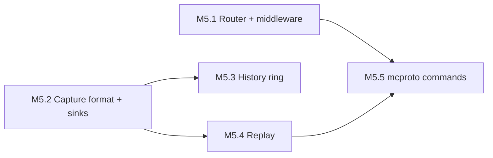

# Routing, capture, replay, and CLI design

- Status: Draft for review
- Date: 2026-08-15
- Repository: `minecraft-protocol`
- Milestone: M5

## Context

After M4 the repository can speak two protocols and complete a login on either.
What it cannot do is let a developer say "when the server sends this, do that",
keep a record of what crossed the wire, or reproduce yesterday's session.

M1 anticipated this. `Observation` already carries a sequence number, a frame
number, a direction, a stage, the session snapshots either side of the commit
point, packet metadata, and owned bytes, delivered in order to a single sink
with lossless backpressure. M5 does not invent the observation path. It builds
the three things that consume it, plus the routing layer that belongs above the
stream, plus the command-line surface that makes all of it usable without
writing Go.

## Goals

- Ordered packet routing and send/receive middleware, defined over interfaces
  narrow enough that they do not require `Stream`.
- A versioned binary capture format that reproduces a session byte for byte,
  with truncation detection and redaction enforcement.
- A bounded in-memory history usable as a debugger's ring buffer.
- Deterministic replay from a capture, offline or against a live peer, with
  explicit timing modes and a verifiable digest.
- A non-interactive `mcproto` with `status`, `login`, `capture`, `inspect`, and
  `replay`, machine-readable output, and documented exit codes.

## Non-goals

- Interpreting captured game state. `inspect` prints packets; it does not build
  a world.
- A GUI, a TUI, or a proxy binary. `proxy` is a separate repository.
- Editing a capture. Replay reads; it never rewrites a recording in place.
- Session-level 775 interoperability, which waits on upstream Node support.
- Any change to framing, compression, or encryption. If M5 needs one, that is a
  finding, not a licence.

## Decision 1: routing lives above the stream, over interfaces

The stream exposes `Read(ctx) (Packet, error)` and
`Write(ctx, Packet) error`. Routing is therefore an ordinary loop over `Read`
plus a dispatch table, and middleware is an ordinary decorator over a one-method
sender.

```go
type Sender interface {
	Send(context.Context, Packet) error
}

type Receiver interface {
	Receive(context.Context) (Packet, error)
}

type Handler interface {
	Handle(context.Context, Packet) error
}

type SendMiddleware func(Sender) Sender
type ReceiveMiddleware func(Handler) Handler
```

`Stream` satisfies `Sender` and `Receiver` through a two-line adapter in the
router package. Nothing in `router` or `middleware` imports the stream, so a
test drives a router over a channel pair and a consumer can put a router on top
of something that is not a `Stream` at all.

Routing keys are `(State, Direction, ID)`, with registration by packet name
resolved through the protocol's descriptor at construction time. Name-based
registration is the ergonomic form; ID-based is what dispatch actually uses,
because a name lookup per packet is a map lookup per packet for no benefit.

Handlers for one key run in registration order. The first error stops the chain
and propagates to the router's run loop, which terminates and returns it. There
is no unhandled-packet default beyond an explicitly registered fallback, and an
unregistered packet is not an error — a client that ignores most of the play
state is the normal case, not a bug.

A panicking handler is not recovered. Go's convention is that a panic is a bug
in the handler, and swallowing it here would hide it behind a stream shutdown.
The router's documentation says so, and the run loop's error path is tested for
the ordinary error case only.

## Decision 2: observations gain elapsed time

`Observation` has ordering but no timing. Replay in recorded-timing mode needs
inter-packet intervals, and a sink cannot recover them: the dispatcher hands
records to the sink in order but with unbounded latency under a slow sink, so a
sink-side clock measures the sink, not the wire.

M5 adds one field, stamped at the observation point:

```go
// Elapsed is the monotonic time from stream start to this record's commit
// point. It is measured where the record is created, not where it is
// delivered, so a slow sink cannot distort a capture's timing.
Elapsed time.Duration
```

Absolute wall-clock time appears once, in the capture header, as the stream's
start time. Per-record wall clock would be redundant and would leak more than
the header does.

## Decision 3: the capture format is binary with a JSON header

A capture is a header the reader can understand without parsing records, then a
sequence of length-prefixed records.

```text
magic       "MCPCAP\x00"                8 bytes
version     u16 little-endian           format version, 1
headerLen   u32 little-endian
header      JSON object, headerLen bytes
records     repeated
trailer     one record of kind trailer
```

The header records what the reader needs to interpret the rest and what a
reviewer needs to trust it:

```json
{
  "protocolId": "java/26.1",
  "protocolVersion": 775,
  "role": "client",
  "startedAt": "2026-08-15T09:12:44.183Z",
  "limits": { "frameBytes": 2097152, "...": 0 },
  "stages": ["raw_frame"],
  "redaction": "enforced",
  "producer": "mcproto/0.4.0"
}
```

Each record is:

```text
length      u32 little-endian, of everything after this field
kind        u8      1 raw frame, 2 packet, 3 string definition, 4 trailer
flags       u8      bit 0 redacted
direction   u8
sequence    varint  stream sequence, monotonic
frame       varint  frame number
elapsedNs   varint
stateRef    varint  index into the string table
nameRef     varint  index into the string table, packet records only
packetId    varint  packet records only
payloadLen  varint
payload     bytes
crc32c      u32 little-endian, over the record excluding this field
```

String definitions are emitted inline the first time a state or packet name
appears, so a reader that starts at byte zero always has the table it needs and
a writer never buffers. The trailer carries the record count, the last sequence,
and a CRC over all record CRCs.

Rationale for binary over JSONL: the payload is the point. A raw frame is bytes,
and base64 in a JSON line costs a third more space and a full encode on the
observation path, which is a path that backpressures the live stream. Human
readability is a property of `mcproto inspect`, not of the file.

**Truncation is expected, not exceptional.** A process killed mid-session
leaves a capture with no trailer. The reader reports the last complete record's
sequence and returns `ErrTruncated` from the point of damage, rather than
failing the whole file. A capture that stops is still evidence.

**Raw frames are the default and the only thing replay needs.** Packet records
are derived from raw ones and are recorded only when asked for, because storing
both roughly doubles the file for information a reader can recompute.

## Decision 4: redaction is enforced by the writer

M2 gives `Observation` a `Redacted` flag and gates plaintext disclosure behind
an explicit `WithSecretDisclosure` opt-in. The capture writer refuses to persist
an unredacted sensitive record unless the header says `"redaction": "disclosed"`,
and that header value can only be produced by a writer constructed with the
matching explicit option.

A redacted payload is written as zero bytes with the redacted flag set and the
original length preserved, so a reader can still see that a 128-byte encryption
response occurred at that point without holding the secret. Replay of a redacted
record into a live connection fails with a named error; replay offline is fine.

`mcproto capture` never disclosed by default and prints a one-line warning to
stderr when disclosure is enabled.

## Decision 5: history is a ring, not a capture in memory

```go
type Ring struct{ /* bounded by records and by bytes */ }

func NewRing(maxRecords, maxBytes int) (*Ring, error)
func (r *Ring) Observe(context.Context, protocol.Observation) error
func (r *Ring) Snapshot() []protocol.Observation // oldest first, owned copies
func (r *Ring) Dropped() uint64
```

The ring is the one place in the observation path that is allowed to lose data,
and it says so: `Dropped` counts what fell off the back. That is the opposite of
the durable sink's contract and it is deliberate. A debugger's last-200-packets
buffer that backpressures a live connection is a worse tool than one that
forgets.

`capture.MultiSink` composes sinks and preserves the strictest contract: if any
sink returns an error, the observation fails and the stream terminates, as M1
specifies.

## Decision 6: replay is deterministic and verifiable

```go
type Mode string

const (
	ModeFast     Mode = "fast"     // no delays
	ModeRecorded Mode = "recorded" // honour Elapsed deltas
	ModeScaled   Mode = "scaled"   // Elapsed deltas times a factor
	ModeStep     Mode = "step"     // one record per Next call
)
```

A player reads a capture and drives one of two destinations:

- **Offline**: decode each raw frame through a session built from the header's
  protocol ID, applying the recorded state transitions. This validates a
  capture, exercises codecs against real traffic, and needs no network.
- **Connected**: write the recorded frames of one direction to a live transport
  and read the peer's responses. Only reachable behind an explicit `--connect`,
  because it sends real packets to a real server.

Determinism is checked, not asserted. A replay produces a digest over the
ordered tuple of `(sequence, direction, state, packetID, payload hash)`. Two
offline replays of the same capture on any platform must produce the same
digest, and `mcproto replay --verify` compares it against a digest recorded in
the capture trailer at write time. A codec change that alters decoding shows up
as a digest mismatch on an old capture, which is the regression test this format
exists to make possible.

Timing is honoured, never manufactured. In recorded mode the player sleeps the
recorded delta minus the time it already spent; it never sleeps to make a fast
machine look slow beyond that, and it reports total drift at the end.

## Decision 7: the CLI is written for non-interactive callers

`mcproto` is a tool that scripts and agents run. That imposes rules, not
preferences:

- Every command is fully specified by flags. There is no prompt, ever, and no
  terminal detection that changes behavior.
- `--format json` on every command that produces data, with a stable schema and
  one object per invocation (or one per line for streams).
- `--input -` and `--output -` mean stdin and stdout. Diagnostics go to stderr,
  data goes to stdout, and the two never mix.
- Documented exit codes: `0` success, `1` runtime failure, `2` usage error,
  `3` protocol or peer failure, `4` verification mismatch. A caller can branch
  on the code without parsing text.
- Errors name the flag that was wrong and show a working example.
- `--help` at every level, with examples in the leaf commands.
- Network commands require an explicit address; no defaults that dial anything.

Command surface after M5:

```text
mcproto data fetch|validate            (M4)
mcproto generate [--check]             (M4, moved off mcdata-gen)
mcproto version [--format json]
mcproto packet decode|encode           bytes on stdin, JSON on stdout
mcproto status  --addr host:port [--protocol N] [--timeout D]
mcproto login   --addr host:port --username U [--offline] [--capture FILE]
mcproto capture --addr host:port --out FILE [--stages raw,packet] [--disclose]
mcproto inspect --input FILE [--filter expr] [--format json|text]
mcproto replay  --input FILE [--mode fast|recorded|scaled|step] [--verify]
                [--connect host:port --direction serverbound]
```

`status` and `login` are thin wrappers over the M2 negotiator and the M4
protocols; they exist because "does this server answer, and can I log in" is the
question a person actually has, and answering it should not require writing a
program.

## Decision 8: `inspect` filters with a small, total expression language

A filter is a conjunction of comparisons over record fields, and nothing else:

```text
--filter 'direction=clientbound state=play name~chunk'
--filter 'id=0x24 sequence>1000'
```

Supported operators are `=`, `!=`, `>`, `<`, and `~` (substring, on string
fields only). No boolean operators, no parentheses, no user-supplied code. A
filter that fails to parse is a usage error naming the offending term.

The reason to define this rather than embed an expression library: the module
has no external dependencies and must keep none, and every filter a person
actually writes at a terminal is a conjunction of three comparisons.

## Dependencies and ordering

M5 depends on M4 for the protocol registry the header names and on M2 for
redaction and the login negotiator. The four bodies of work inside M5 are mostly
independent:



| Stage | Exit criterion |
| --- | --- |
| M5.1 | Handlers run in registration order over a non-stream transport; a send middleware chain nests in declaration order; no `router` file imports `Stream` |
| M5.2 | A capture round-trips byte for byte; a file truncated at every byte offset reports the last good sequence and no panic; an undisclosed secret cannot reach disk |
| M5.3 | A full ring drops oldest first, reports the count, and never blocks the stream |
| M5.4 | Two offline replays of a captured login produce the same digest on Linux and macOS; `--verify` fails loudly on a mutated payload |
| M5.5 | Every command's `--help` and `--format json` are covered by a black-box test; every documented exit code is produced by a test |

## Risks

**The observation path is on the live stream's critical path.** A durable sink
that fsyncs per record would throttle a session to disk latency. The file sink
buffers and flushes on a size or time boundary, syncs on close, and documents
that a crash loses the tail — which the trailer's absence already announces.

**Capture files hold session content.** Chat, positions, and — with disclosure
enabled — key material. The format is not encrypted and the tool does not
pretend otherwise. `mcproto capture` prints where it wrote and what redaction
mode it used, and the design refuses to make disclosure convenient.

**Digest stability is a contract.** Once a capture carries a digest, changing
how the digest is computed invalidates every old capture. The digest input is
therefore versioned in the header, and a reader that meets an unknown digest
version reports it rather than comparing.

**Replay against a live server is a footgun.** It sends recorded packets to a
real peer, out of their original context. It is behind `--connect`, defaults
off, refuses redacted records, and the help text says what it does.

## Open questions

1. Should `capture` also record outbound writes rejected by backpressure? They
   never reached the wire, so they are not part of the session; recording them
   under a distinct kind would help debug the consumer. The plan leaves them
   out and notes the option.
2. Should the ring be exposed through `Stream` directly for convenience, or only
   composed by the caller? The plan keeps composition explicit, so the stream
   keeps exactly one sink.
